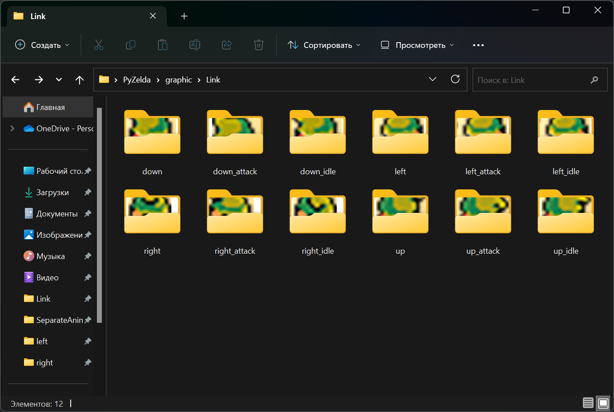

# Анимация Линка

Сначала нужно добавить действие и кнопку. На атаку будет стоять кнопка "Пробел". Пропишем это в `player.py`:

```python
if keys[pygame.K_SPACE] and not self.attacking:
    self.attacking = True
```

Непонятно, что такое `self.attacking`. В демоны файла я добавил три параметра: статус атаки (`self.attacking = False`), кулдаун после атаки (`self.attack_cooldown = 400`) и время атаки (`self.attack_time = None`).

Добавим время между атаками. После успешной атаки создадим конструкцию: `self.attack_time = pygame.time.get_ticks()` сразу после объявление атаки флагом `True`. Далее перейдём к настройке нового метода `cooldowns`. Сам метод:

```python
def cooldowns(self):
    current_time = pygame.time.get_ticks()
​
    if self.attacking:
        if current_time - self.attack_time >= self.attack_cooldown:
            self.attacking = False
```

Конструкция очень проста. Если разница во времени после нажатия меньше кулдауна атаки (в моём случае 400 мс), запрещать атаку. Не забудьте закинуть функцию cooldowns в update-функцию.

Далее, пропишем метод `import_player_assets`:

```python
def import_player_assets(self):
    character_path = '../graphic/Link/'
    self.animations = {'up': [], 'down': [], 'left': [], 'right': [],
    'right_idle': [], 'left_idle': [], 'up_idle': [], 'down_idle': [],
    'right_attack': [], 'left_attack': [], 'up_attack': [], 'down_attack': []}
```

В нём прописаны все возможности передвижения. Они лежат в папке "Link":

<figure><figcaption></figcaption></figure>

Не забудьте закинуть в базовых демонов Player-класса наши ассеты: `self.import_player_assets()`. Далее, "пробежимся" по нашим папкам благодаря методу `import_folder` в `support.py`:

```python
for animation in self.animations.keys():
    full_path = character_path + animation
    self.animations[animation] = import_folder(full_path)
```

Сейчас мы можем открыть все файлы, но есть дополнительная проблема — нужно прописать статусы и анимации при нажатии на кнопку. Статус по умолчанию укажем в демоне и по умолчанию Линк будет смотреть вниз (`self.status = 'down'`). Но этого мало. Нужно получать статус автоматически, а это значит новый метод:

```python
def get_status(self):
    if self.direction.x == 0 and self.direction.y == 0:
        self.status = self.status + '_idle'
```

Прописываем название файла "стояния" героя. Стояние — `_idle`, а статус будет меняться от нажатия кнопок. Закидываем `get_status()` в update-метод.

Пропишем статусы для наших методов хождения:

```python
if keys[pygame.K_UP]:
    self.direction.y = -1
    self.status = 'up'
elif keys[pygame.K_DOWN]:
    self.direction.y = 1
    self.status = 'down'
else:
    self.direction.y = 0
​
if keys[pygame.K_LEFT]:
    self.direction.x = -1
    self.status = 'left'
elif keys[pygame.K_RIGHT]:
    self.direction.x = 1
    self.status = 'right'
```

Тут всё достаточно прозрачно. Движение = статусу. Подправим функцию статуса:

```python
if not 'idle' in self.status:
    self.status = self.status + '_idle'
```

Если мы отпускаем кнопку — статус равен idle, а если держим просто название направления.

Теперь окончательно проапгрейдим код для атак и комбинаций с "\_idle":

```python
def get_status(self):
    if self.direction.x == 0 and self.direction.y == 0:
        if not 'idle' in self.status and not 'attack' in self.status:
            self.status = self.status + '_idle'
    if self.attacking:
        self.direction.x = 0 #координаты по x
        self.direction.y = 0 #координаты по y
        if not 'attack' in self.status: #если нет подписи "attack"
            if 'idle' in self.status: #но есть "idle"
                self.status = self.status.replace('_idle', '_attack') #убираем _idle, но оставляем _attack
            else:
                self.status = self.status + '_attack' #если idle не было, просто стави attack
    else:
        if 'attack' in self.status:
            self.status = self.status.replace('_attack', '') #удаляем attack при завершении статуса
```

Наконец, заанимируем Линка. Установим два новых демона `self.frame_index = 0` — индекс первой картинки и скорость смены картинок — `self.animation_speed = 0.15`. Затем создадим метод `animate()`:

```python
def animate(self):
    animation = self.animations[self.status] #узнаём статус для ссылки на нужный файл
    self.frame_index += self.animation_speed #добовляем нашу скорость и когда добавится единица (из 0.15), сменяем картинку
    if self.frame_index >= len(animation): #при вылете из массива
        self.frame_index = 0 #возвращаемся к начальной картинке и тем самым зацикливаемся
    self.image = animation[int(self.frame_index)] #указываем картику
    self.rect = self.image.get_rect(center = self.hitbox.center) #указываем хитбокс
```

Сейчас мы перебираем все наши картинки и главное — их зациклить, как в рилсах. Не забываем в update-функцию `self.animate()`.

Тут у меня залогала анимация атаки, так как кнопка продолжала нажиматься. Исправим это в input-методе:

```python
def input(self): #варьируем кнопки
    if not self.attacking:
        keys = pygame.key.get_pressed()
​
        if keys[pygame.K_UP]:
            self.direction.y = -1
            self.status = 'up'
        elif keys[pygame.K_DOWN]:
            self.direction.y = 1
            self.status = 'down'
        else:
            self.direction.y = 0
​
        if keys[pygame.K_LEFT]:
            self.direction.x = -1
            self.status = 'left'
        elif keys[pygame.K_RIGHT]:
            self.direction.x = 1
            self.status = 'right'
        else:
            self.direction.x = 0
​
        if keys[pygame.K_SPACE]:
            self.attacking = True
            self.attack_time = pygame.time.get_ticks()
```

Итог:

<figure><figcaption></figcaption></figure>

Далее прорисуем оружие. [Файлы этого этапа](https://disk.yandex.ru/d/VVjRMFfvxHqLHg).
