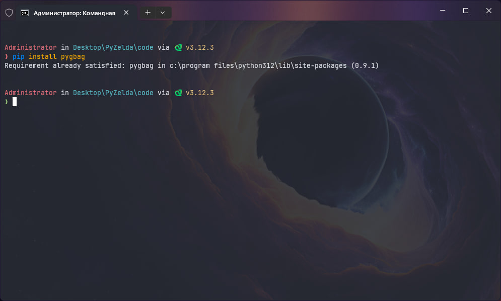
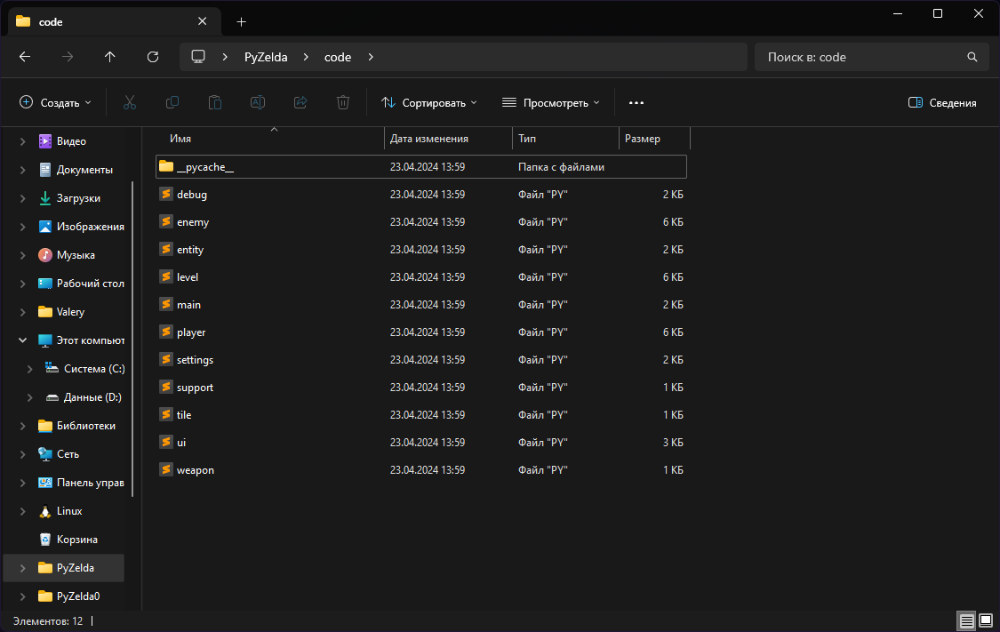
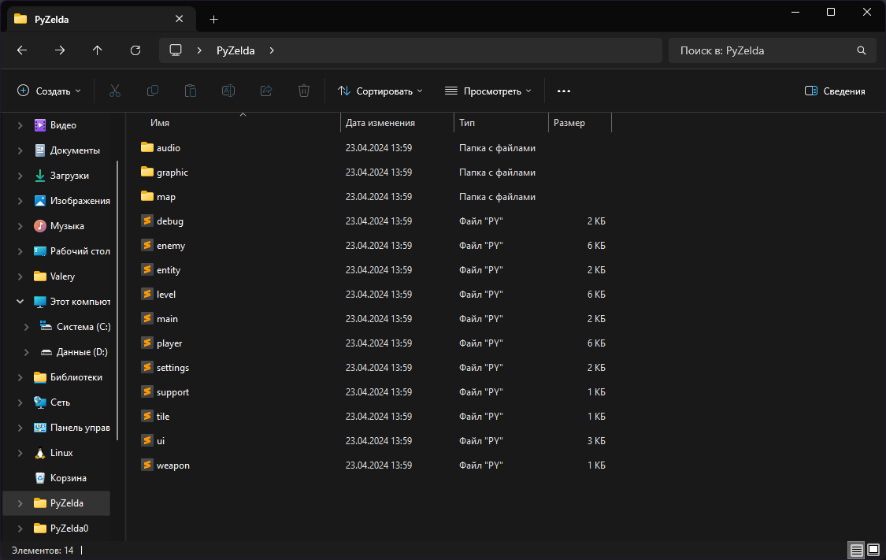
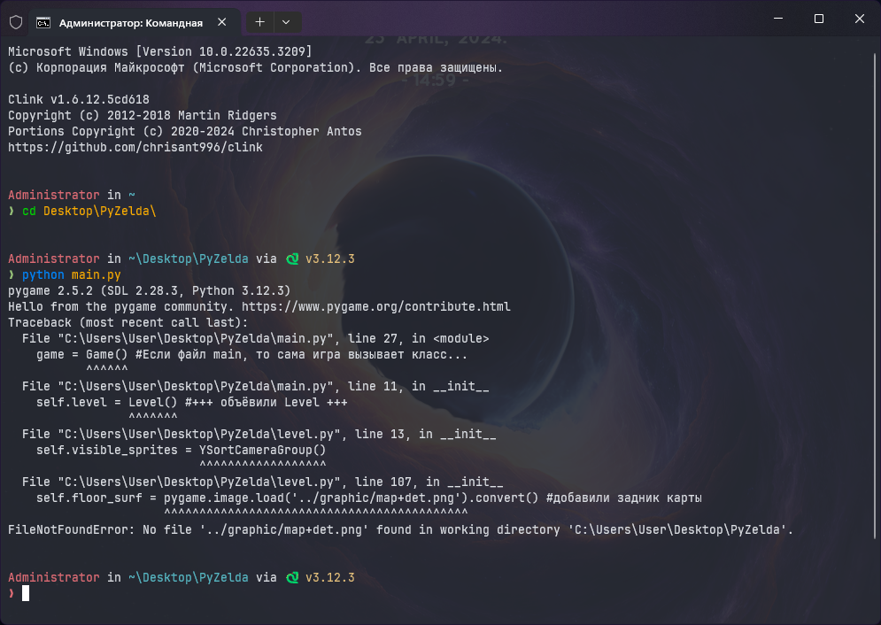
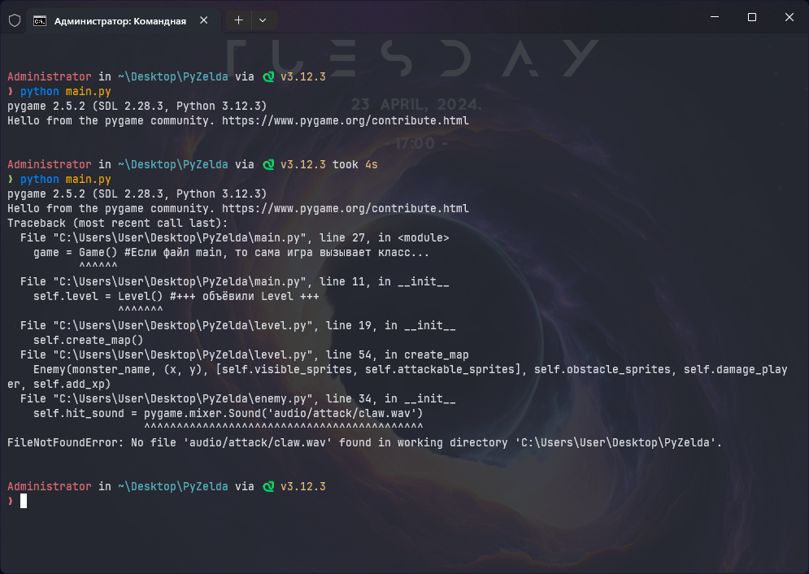
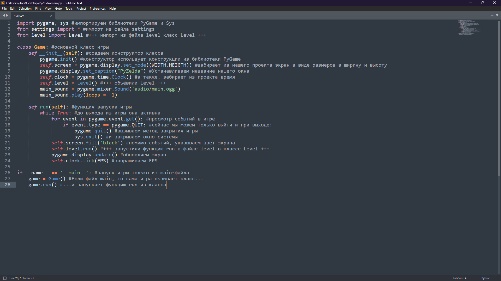
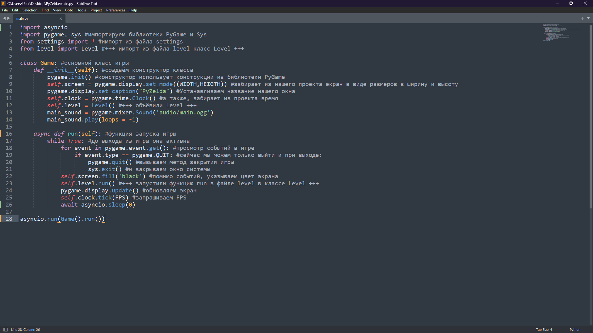
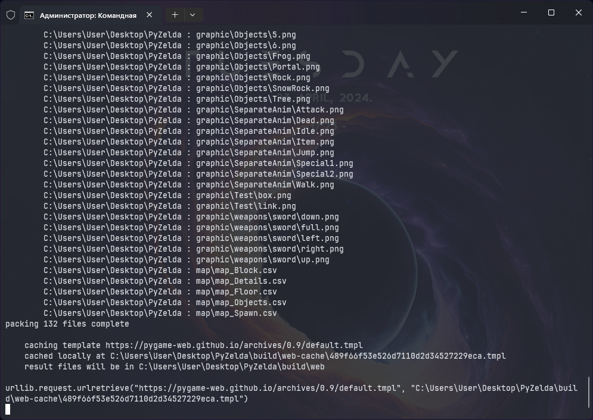
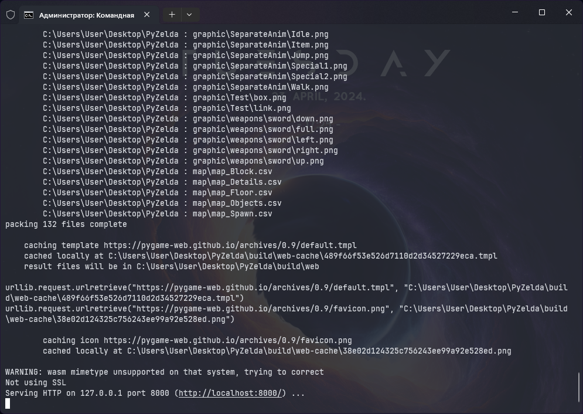
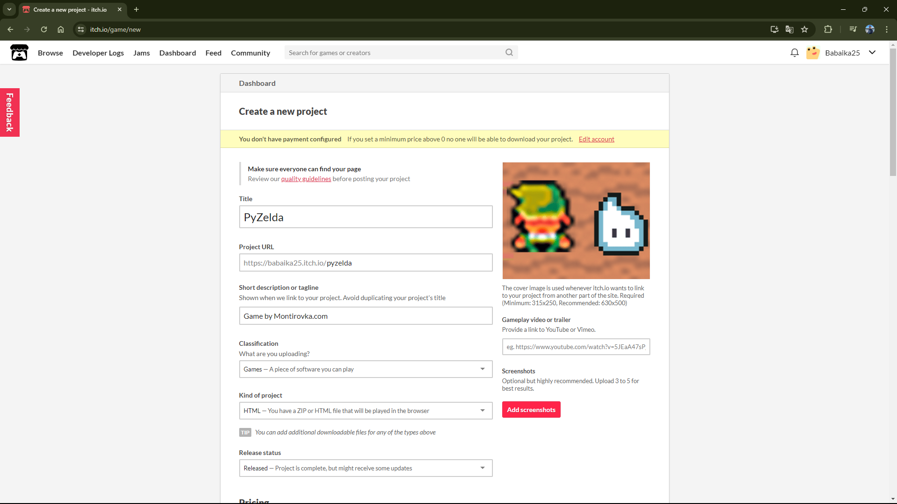

# Деплой

Как и любой шедевр, игру должен увидеть свет. Если сейчас скачать все файлы с доработками — можно поиграть в игру, но с несколькими "но":

1. Мы не сможем запустить игру без ПК на Windows или Linux. Это нормально, учитывая, что мы писали игру под компьютер.
2. Нужно установить python на машину, а для этого хоть немного понимать в программировании и не бояться терминала и командной строки. Это уже весомый минус.
3. Нужно скачать все библиотеки. Так как мы использовали только pygame, то её нам и нужно скачать. Для питониста — ничего сложного, а вот для геймера — трудность и шанс скинуть игру в ту, которую он не будет смотреть.

Из-за этого, было принято решение (спасибо за идею Стасу Фомину) отдеплоить Зельду на web-интерфейс.

Деплой — это процесс выгрузки проекта в сеть Интернет. Игры в Интернете ушли с уходом Adobe Flash Player, так как писать игры на флеше было бы глупо, учитывая, что Adobe запретили использовать их утилиту в сети из-за отсутствия безопасности. Из-за этого все онлайн-игры перешли либо на мобильные устройства, либо на язык, который проприетарно был нужен для работы с вебом (JavaScript), либо студии пишут свою платформу и архитектуру для своих же серверов. Писать сервер на питоне — невозможно, так как питон является высокоуровневым языком программирования и написать драйвера (программы для работы с оборудованием) на нём невозможно (давайте не будет пытаться запустить на стороннем ПК интерпретатор, который будет посылать запросы на ассемблере серверу). Возрождать флеш — тоже не самая лучшая идея, так как смахивает на некрофилию и пережитки технологий (что мертво - умереть не может, поэтому на просторах Интернета можно всегда найти версии флеш-плеера). На JS я не хочу идти, так как не по-геройски конкурентов поддерживать. Решение было предоставлено Веб Ассамблеей.

**WebAssembly** — язык программирования низкого уровня, призванный внести программируемость туда, где нужны кроссплатформенность, эффективность и безопасность, в первую очередь на клиентскую сторону Всемирной паутины. Программирование идёт на обычных статически типизированных языках, таких как Си, C++, C#, Rust, Go. Стековая виртуальная машина, исполняющая инструкции бинарного формата wasm, может быть запущена как в среде браузера, так и в серверной среде. Код на wasm — переносимое абстрактное синтаксическое дерево, что обеспечивает как более быстрый анализ, так и более эффективное выполнение в сравнении с JavaScript.

Как вы уже могли понять, wasm также работает с Python. Я буду запускать код на своём ПК, wasm будет его переводить в "околобинарный" вид. Приставка"около", так как мы работаем в псевдопростанстве, где невозможно перевести всё в бинарники, но можно написать правила взаимодействия с нашими стандартами сжатия и работы с высокоуровневыми системами. Более того, мы даже не запускаем код, а запускаем отпечаток, который запустился на моём ПК и этот отпечаток деплоим в веб. Этот подход "съест" настраиваемость, но даст прирост в производительности. Код работает быстрее, чем на JS (Хах!). Ну да хватить разглагольствовать, давайте приступать.

Первым делом устанавливаем библиотеку pygbag.

<figure><figcaption></figcaption></figure>

Тут всё просто: `pip install pygbag`. Это вторая библиотека, которую мы используем за всё время работы (не считая базовые). Вы можете этого не делать, если хотите оставить проект в самом первозданном виде. Я же хочу, чтобы в игру поиграли другие пользователи и выложу её в сеть.

Теперь, как написано в [официальной документации](https://pygame-web.github.io/), мне нужно пересобрать проект по следующим позициям:

1. Перенести файл запуска игры в корень. Я решил убрать директорию "code".
2. Внутри main-функции нужно создать отслеживание потока.
3. Нужно сжать всё, что можно сжать. В моём случае, это .wav-фалы. Их я сожму до .ogg.
4. Переписать все пути внутри всех файлов (самая кропотливая работа).

Приступим.

Сейчас моя папка "code" выглядит так:

<figure><figcaption></figcaption></figure>

Папку кеша (`__pycache__`) можно удалить. Она нужна для ускорения запуска игры и запоминает временные файлы. Сейчас они все изменятся, так как пути будут недействительны, так что она нам не нужна.

Теперь файлы проекта все в одном месте:

<figure><figcaption></figcaption></figure>

При попытке запуска, мы получим следующее:

<figure><figcaption></figcaption></figure>

Проблема с путями. Нужно все пути с "`../`" (предыдущая директория), поменять на текущую директорию, так как для запуска файла, раньше нам нужно было подняться из папки "code" в корень и оттуда спуститься, например в директорию "graphic", теперь же -- просто спуститься в директорию "graphic". Ctrl+F нам в помощь. У меня исправлять пришлось файлы:

* weapon.py
* enemy.py
* level.py
* main.py
* player.py
* settings.py

После всех исправлений, запустим `main.py` и всё должно работать. Теперь заменим все файлы звуков с `.wav` на `.ogg`. Не забудьте заменить расширения в коде, чтобы не получить это:

<figure><figcaption></figcaption></figure>

Я заменял формат звуков в следующих файлах:

* enemy.py
* main.py
* player.py
* settings.py

Когда замена произойдёт, вы не почувствуете разницы в звучании, но файлы "ужались" в 10 раз. Нужно это было для грамотной работы веба.

Осталось сделать отслеживание потока в main-файле в main-функции. Сейчас наш код в файле `main.py` выглядит так:

<figure><figcaption></figcaption></figure>

Исправим несколько моментов:

* Импортируем библиотеку `asyncio`
* `run`-метод делаем потоковым
* Завершения данного метода — `await`-функция
* Проверку if-ом заменим на асинхронный запуск метода

Итог:

<figure><figcaption></figcaption></figure>

Библиотека `asyncio` позволяет увидеть потоки данных. В вебе, большинство (можно сказать "все") потоков асинхронны, а отслеживать их нужно по PID'ам (Process IDentificator). Вот этим мы и будем заниматься. Функция отслеживания — `run` в классе `Game`, там же мы будем ждать завершения операции. Сами процесс мы не должны запускать, как было с if-ом, а передаём эту задачу потоковому процессу (`asyncio.run(Game().run())`). При запуске ничего не должно поменяться.

Теперь в командной строке (или терминале) переходим на директорию выше и запускаем `pygbag` директории (в моём случае, это "PyZelda"). Таким образом, из директории мы делаем хостинг сервер, который в процессе инициализации будет собирать все потоки в псевдобиты и кешировать всё, что возможно.

В моём проекте получилось 132 файла:

<figure><figcaption></figcaption></figure>

Чуть подождав (примерно, 2 минуты), терминал предложит перейти на localhost:8000. Это созданный сервер.

<figure><figcaption></figcaption></figure>

Перейдите и там будет пустой экран, далее пойдёт сборка всех функций. Теперь можно пойти попить чай, кофе или что покрепче, ведь ждать предстоит минут 5, пока все варианты событий будут проиграны. Дождитесь когда на экране начнётся игра. Процесс можно завершить закрытием терминала или сочетанием Ctrl+C.

Теперь, в папке с проектом, вы обнаружите новую директорию `build`. Это как раз тот билд, который мы собирали из процессов. Внутри директории ещё две: `web` и `web-cache`, а также файл с версией сборщика. В папке `web` лежит всё для деплоя проекта. Я же решил выгрузить его на [itch.io](https://itch.io/). Чтобы это делать, я создал `.zip`-архив папки `web` и выгрузил проект с такими настройками:

<figure><figcaption></figcaption></figure>

Теперь вы сможете насладиться [данным Величием](https://montirovka.itch.io/pyzelda)!
