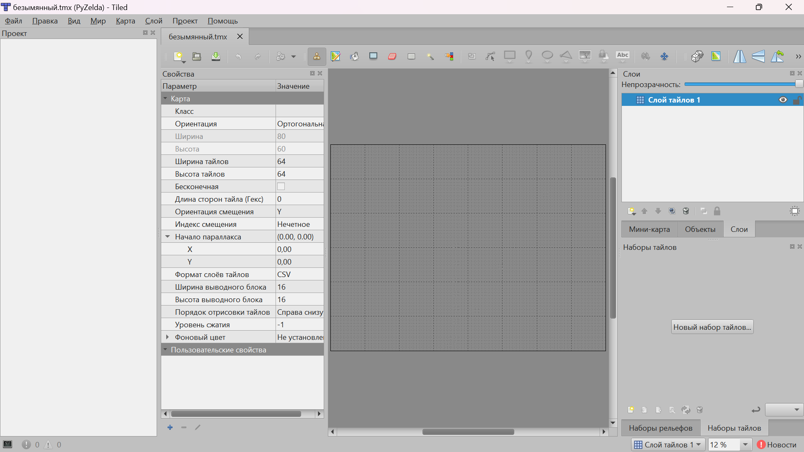
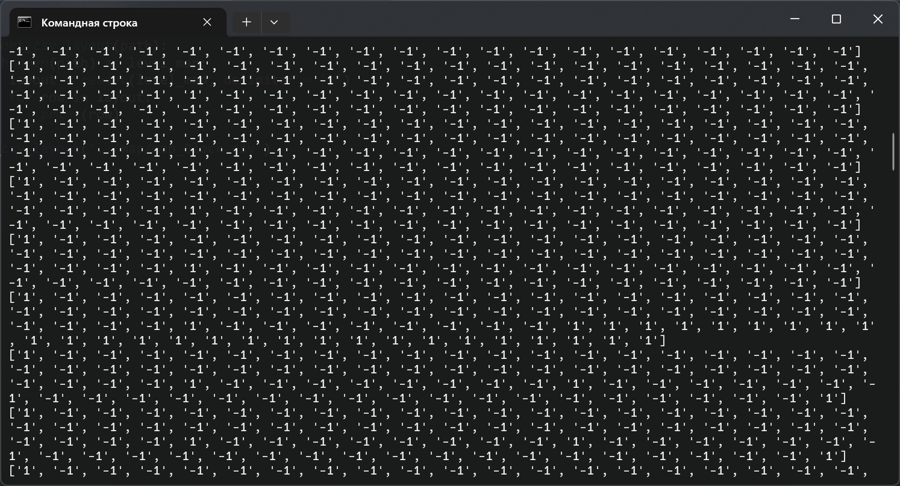

# Графика

Мне пришлось освоить для себя новую программу. Она была очень дружелюбной, и со второго раза я смог нарисовать поле игры. Программа называется [Tiled](https://www.mapeditor.org/). В ней можно легко настраивать карты. Сразу оговорюсь, что это мой первый опыт работы с картами. Это сыграло со мной злую шутку. Дважды.

Чуть ранее я писал про проблемы с ассетами. Дело в том, что я выбрал размер тайла 64 пикселя. Это стандартное разрешение для игр в ряд, но я не учёл один момент — все ассеты, которые были у Ninja Adventure были в разрешении 16 на 16 пикселей. Это нормально для пиксельной графики. В общем, была задача поправить это расхождение. Поправка была простой — я увеличил размер нужных мне тайлов в 4 раза в фотошопе. В итоге, получилось из этого:

<figure><figcaption></figcaption></figure>

Сделать это:

<figure><figcaption></figcaption></figure>

Для отрисовки карты, я взял 3 файла (TilesetFloor.png, TilesetFloorDetails.png и TilesetWater.png):

<figure><figcaption></figcaption></figure>

> **Что-то типа ворнинга**. Тут будьте осторожны. Мне пришлось перерисовать карту и сделать из разных картинок с тайлами одну. Не повторяйте моих ошибок и сначала прочитайте что происходит ниже в разделе "Монстры".

Помимо прочего, я создал зелёный квадрат 64 на 64 и такой же красный с прозрачностью в 20%, чтобы поставить точку спауна Линка и невидимые стены для него. Приступим к отрисовке карты.

Открываем Tiled и выставляем следующие настройки: ортогональная карта лежит в координатах x и y, что нам и подходит. Слой будет выводиться в формате CSV и отрисовываться справа снизу. Размеры карты будут 80 на 60 тайлов, а это значит 80 на 64 = 5120 и 60 на 64 = 3840 пикселей.

<figure><figcaption></figcaption></figure>

Создав карту, получим своё рабочее поле и приступим к рисованию:

<figure><figcaption></figcaption></figure>

Час работы и результат:

<figure><figcaption></figcaption></figure>

Сейчас работа очень грубая. Нужно добавить деталей. Займёмся этим. Вот что получилось спустя минут 20:

<figure><figcaption></figcaption></figure>

Далее я добавил тайлы-блоки, чтобы за них Линк не выбрался (куда ж без невидимых стен). Главное — все поля должны быть замкнуты, чтобы Линк внезапно не залетал. У меня получилось как-то так:

<figure><figcaption></figcaption></figure>

Потом я выключил данный слой, чтобы он не отвлекал. Далее, проставим места спауна монстров (бебов) и главного героя – Линка:

<figure><figcaption></figcaption></figure>

Добавим пару объектов:

<figure><figcaption></figcaption></figure>

Конечно, карта может быть детальнее проработана, но это не моя задача. Моя задача — проверить как там игродев на змейке.

Всю графику я перенёс в папку graphic, а также выгрузил карту в `.csv`-формате в папку map.

Приступим к коду. Для начала, я скинул в папку Test нашего Линка и коробку и поправил пути в проекте в файлах `player.py` и `title.py`. После запуска ничего не поменялось. Далее я решил положить подложкой на чёрный экран карту. Я экспортировал картинку без спауна и дополнительных объектов и установил её выше чёрного экрана, но ниже Линка с коробками. Для этого в файле `level.py` я объявил о наличии таких файлов двумя строками кода в демонах класса `YSortCameraGroup`:

```python
self.floor_surf = pygame.image.load('../graphic/map+det.png').convert() #добавили задник карты
self.floor_rect = self.floor_surf.get_rect(topleft = (0, 0)) #отрисовка карты с левого верхнего угла
```

Далее в методе `custom_draw` вычисляем отрисовку с офсетами для камерами (всё ровно также, как и ранее):

```python
floor_offset_pos = self.floor_rect.topleft - self.offset
self.display_surface.blit(self.floor_surf, floor_offset_pos)
```

Результат:

<figure><figcaption></figcaption></figure>

Происходит наслоение старой карты и новой. Исправим это: удалим всё в методе `create_map` в `level.py`. Немного переписав метод, я привёл его к следующему виду:

```python
def create_map(self):
    self.player = Player((1000, 1000), [self.visible_sprites], self.obstacle_sprites)
```

Всё что я оставил — это отрисовку места Линка на карте. Просто указал координату.

<figure><figcaption></figcaption></figure>

Теперь наша задача провзаимодействовать с файлом `tile.py` Ему нужны более детальные настройки для прорисовки объектов и картинок конкретного размера. Приступим.

Для начала помимо прочих элементов, демонам нужно передавать новые два аргумента `sprite_type` и `surface = pygame.Surface((TILESIZE, TILESIZE))`. Думаю, по названию понятно, что они будут передавать тип спрайта и его размер из файла `settings.py`. Ещё немного переработаем файл и получим упрощение конструкции с ссылкой на себя:

```python
import pygame
from settings import *
​
class Tile(pygame.sprite.Sprite):
    def __init__(self, pos, groups, sprite_type, surface = pygame.Surface((TILESIZE, TILESIZE))):
        super().__init__(groups) #наследуем все группы
        self.sprite_type = sprite_type
        self.image = surface
        self.rect = self.image.get_rect(topleft = pos) #указываем позицию отрисовки (левый верхний угол)
        self.hitbox = self.rect.inflate(0, -10) #делаем по 5 пискселей сверху и снизу от самого объекта, до хитбокса
```

Вернёмся в `creat_map`. Создадим новый словарь на основе csv-файлов:

```python
layout = {
        'boundary': import_csv_layout('../map/map_Block.csv')
}
```

Метод `import_csv_layout` нам не знаком. Напишем его в новой файле `support.py`.

```python
from csv import reader
​
def import_csv_layout(path):
    with open(path) as level_map:
        layout = reader(level_map, delimiter = ',')
        for row in layout:
            print(row)
​
import_csv_layout('../map/map_Block.csv')
```

В данном коде идёт чтение csv-файла. А при чтении "1" — означает, что объект там есть, а "-1" — его там нет.

Результат вывода `support.py`:

<figure><figcaption></figcaption></figure>

Чуть подправим, чтобы у нас на выходе была матрица (массив из выведенных строк) и функция готова:

```python
from csv import reader
​
def import_csv_layout(path):
    terrain_map = []
    with open(path) as level_map:
        layout = reader(level_map, delimiter = ',')
        for row in layout:
            terrain_map.append(list(row))
        return terrain_map
```

Теперь, вернёмся к `creat_map` и допишем функцию очень похожую на то, что было ранее (не забудьте импортировать support):

```python
def create_map(self):
    layout = {
            'boundary': import_csv_layout('../map/map_Block.csv')
    }
    for style, layout in layout.items():
        for row_index, row in enumerate(layout):
            for col_index, col in enumerate(row):
                if col != '-1':
                    x = col_index * TILESIZE
                    y = row_index * TILESIZE
                    if style == 'boundary':
                        Tile((x, y), [self.visible_sprites, self.obstacle_sprites], 'invisible')
    self.player = Player((1000, 1000), [self.visible_sprites], self.obstacle_sprites)
```

Итог:

<figure><figcaption></figcaption></figure>

Чёрные края — это невидимые стены. Осталось их только сделать невидимыми. Удалим `self.visible_sprites`.

Создадим ещё один вариант стиля — `objects`. Тут нам потребуется сразу несколько картинок. Чтобы не перебирать их вручную в `support.py` создадим новый метод поиска картинок при помощи знакомым многим функции walk:

```python
def import_folder(path):
    for _, __, img_files in walk(path):
        for image in img_files:
            full_path = path + '/' + image
            print(full_path)
```

Получим вывод:

<figure><figcaption></figcaption></figure>

Немного перепишем метод под pygame:

```python
def import_folder(path):
    surface_list = []
    for _, __, img_files in walk(path):
        for image in img_files:
            full_path = path + '/' + image
            image_surf = pygame.image.load(full_path).convert_alpha()
            surface_list.append(image_surf)
    return surface_list
```

Метод отрисовки объектов:

```python
if style == 'objects':
    surf = graphics['objects'][int(col)]
    Tile((x, y), [self.visible_sprites, self.obstacle_sprites], 'object', surf)
```

Перебором по всем файлам выставляем объекты. Но есть одна проблема. Если объекты были друг за другом — они хаотично ставятся. Исправим это в `tile.py`:

```python
if sprite_type == 'object':
    self.rect = self.image.get_rect(topleft = (pos[0], pos[1] - TILESIZE))
else:
    self.rect = self.image.get_rect(topleft = pos) #указываем позицию отрисовки (левый верхний угол)
```

В этом моменте мы отключили перекрытие объектом других объектов. Итог — Линк гуляет в лесу!

[Результат работы по ссылке](https://disk.yandex.ru/d/eKerCcYDe7tTqA). Помимо прочего, оставляю проект в Tiled, чтобы вы сами могли "поиграться" с ним. Далее мы поговорим об анимации.
