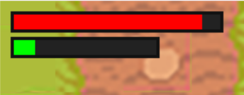
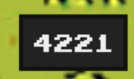
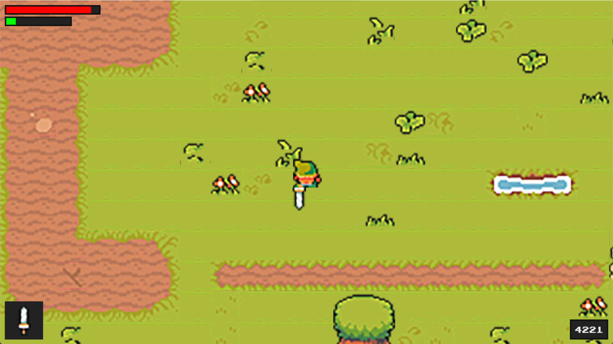

# Интерфейс

Наша задача — сделать интерфейс игры. Первым делом, нужно создать такие простые вещи как базовые параметры. У нас уже есть один параметр. Это скорость. Сейчас допишем остальные параметры. В демоны в файле `player.py` запишем следующие параметры:

```python
self.stats = {'health': 100, 'energy': 60, 'attack': 10, 'speed': 5} #все параметры героя
self.health = self.stats['health'] #соотношение со здоровьем
self.energy = self.stats['energy'] #соотношение с энергией
self.exp = 4221 #количество очков
self.speed = self.stats['speed'] #скорость игрока
```

Все параметры указаны и можно удалить параметр скорости из демона ранее. Особенно хорошо, что Линк уже набрал 4221 очка за просмотр себя на ютюбе у Артура из Уфы. В файле settings.py Добавим немного параметров отображения:

```python
BAR_HEIGHT = 20 #толщина всех панелек
HEALTH_BAR_WIDTH = 200  #длина панельки здоровья
ENERGY_BAR_WIDTH = 140 #длина панельки энергии
ITEM_BOX_SIZE = 80 #размер значка под предмет
UI_FONT = '../graphic/font/joystix.ttf' #основной шрифт
UI_FONT_SIZE = 18 #кегель шрифта
​
UI_BG_COLOR = '#222222' #цвет задника
UI_BORDER_COLOR = '#111111' #цвет обводки
TEXT_COLOR = '#EEEEEE' #цвет текста
​
HEALTH_COLOR = 'red' #цвет здоровья
ENERGY_COLOR = 'green' #цвет энергии
```

Тут самый важный момент — добавить шрифт. Самый его большой плюс в том, что он поддерживает русский язык. Теперь в настройках уровня укажем нового демона `self.ui = UI()` и импортируем сам файл в проект. Добавим в run-метод правило отрисовки:

```python
self.ui.display(self.player)
```

Теперь создадим новый файл `ui.py`:

```python
import pygame
from settings import *
​
class UI:
    def __init__(self):
        self.display_surface = pygame.display.get_surface() #прорисовка самого экрана
        self.font = pygame.font.Font(UI_FONT, UI_FONT_SIZE) #добавление стандартного шрифта
        self.healt_bar_rect = pygame.Rect(10, 10, HEALTH_BAR_WIDTH, BAR_HEIGHT) #панелька для здоровья
        self.energy_bar_rect = pygame.Rect(10, 34, ENERGY_BAR_WIDTH, BAR_HEIGHT) #панелька для энергии
​
    def show_bar(self, current, max_amountm, bg_rect, color):
        pygame.draw.rect(self.display_surface, UI_BG_COLOR, bg_rect) #отрисовка задника панельки
        ratio = current / max_amountm
        current_with = bg_rect.width * ratio
        current_rect = bg_rect.copy()
        current_rect.width = current_with
        pygame.draw.rect(self.display_surface, color, current_rect) #рисование панельки
        pygame.draw.rect(self.display_surface, UI_BORDER_COLOR, bg_rect, 3) #рисование обводки панельки
​
    def display(self, player):
        self.show_bar(player.health, player.stats['health'], self.healt_bar_rect, HEALTH_COLOR) #обращение к отрисовке панели здоровья
        self.show_bar(player.energy, player.stats['energy'], self.energy_bar_rect, ENERGY_COLOR) #обращение к отрисовке панели энергии
```

Из интересного, тут есть строки рассчётов:

```python
ratio = current / max_amountm
current_with = bg_rect.width * ratio
current_rect = bg_rect.copy()
current_rect.width = current_with
```

Мы переводим значения нашего здоровья в проценты прорисовки в поле пикселей. Нам нужно перевести даже 140 очков здоровья в 100%. Для этого, мы запрашиваем `current` — очки здоровья и делим их на длину нашего поля здоровья (`max_amountm`), далее перемножаем это с `bg_rect.width` для отображения в поле. Я поставил в player.py значение здоровья на -10 и -50 на энергию:

```python
self.health = self.stats['health'] - 10 #соотношение со здоровьем
self.energy = self.stats['energy'] - 50 #соотношение с энергией
```

Результат:

<figure><figcaption></figcaption></figure>

Нарисуем же наши очки. Переходим опять к `ui.py` и создадим новый метод `show_exp`:

```python
def show_exp(self, exp):
    text_surf = self.font.render(str(int(exp)), False, TEXT_COLOR) #рендер шрифта с экспой, без сглаживания и с цветом
    x = self.display_surface.get_size()[0] - 20 #отступ снизу на 20 пикселей по x
    y = self.display_surface.get_size()[1] - 20 #отступ снизу на 20 пикселей по y
    text_rect = text_surf.get_rect(bottomright = (x, y)) #цепляемся за низ экрана справа
​
    pygame.draw.rect(self.display_surface, UI_BG_COLOR, text_rect.inflate(20, 20)) #цепляемся за низ экрана справа
    self.display_surface.blit(text_surf, text_rect) #отображаем панельку
    pygame.draw.rect(self.display_surface, UI_BORDER_COLOR, text_rect.inflate(20, 20), 3) #обводка панели
```

Из интересного: тут стоит False в методе `self.font.render`. Данный метод выключает сглаживание, так как у меня пиксельный шрифт. А также, pygame сделали крутой метод `text_rect.inflate`, который помогает вписать текст в панельку. Результат удивительно прекрасен:

<figure><figcaption></figcaption></figure>

Последний шаг — прорисовка меча Линка. Для начала, нужно прописать в базовых демонах наш список оружия. У меня в наличии только одно оружие, так что этот кусок кода можно упростить, но я оставил возможность подбирать оружие и добавить его в словарь оружия, а затем и в этот список:

```python
self.weapon_graphics = []
for weapon in weapon_data.values():
    path = weapon['graphic']
    weapon = pygame.image.load(path).convert_alpha()
    self.weapon_graphics.append(weapon)
```

Далее пишем простой метод для отображения предметов:

```python
def weapon_overlay(self, weapon_index):
    bg_rect = pygame.Rect(10, 630, ITEM_BOX_SIZE, ITEM_BOX_SIZE)
    pygame.draw.rect(self.display_surface, UI_BG_COLOR, bg_rect)
    weapon_surf = self.weapon_graphics[weapon_index]
    weapon_rect = weapon_surf.get_rect(center = bg_rect.center)
​
    self.display_surface.blit(weapon_surf, weapon_rect)
```

В конце не забудьте добавить отображение оружия в display-методе: `self.weapon_overlay(player.weapon_index)`.

Результат:

<figure><figcaption></figcaption></figure>

[Файлы проекта](https://disk.yandex.ru/d/WwhG3l8y5LrT5A) и дальше будем писать монстры (более известных как бебы).
