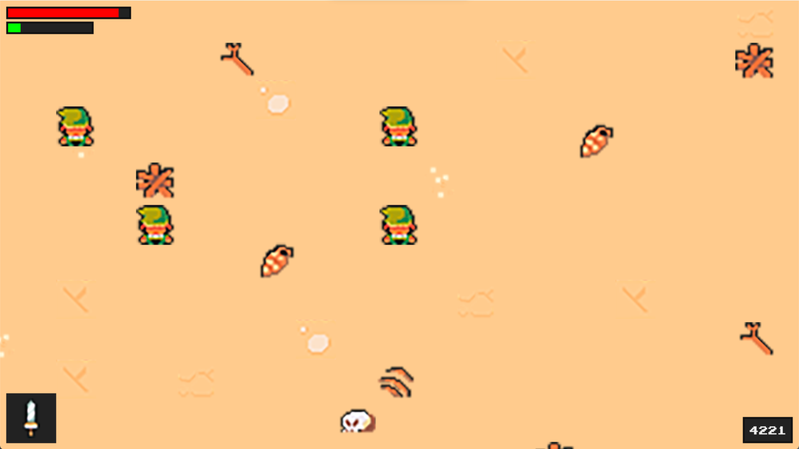

# Монстры

Для начала, я прописал референсы для монстры. Они хранятся в папке `graphic/monsters`. Также я добавил звуки ударов и закинул их в папку `audio/attack` Далее, в setting.py прописаны их входные данные:

```python
monster_data = {
    'axalot': {'health': 200, 'exp': 400, 'damage': 40, 'attack_type': 'slash', 'attack_sound': '../audio/attack/slash.wav', 'speed': 3, 'resistance': 3, 'attack_radius': 80, 'notice_radius': 300},
    'lizard': {'health': 50, 'exp': 100, 'damage': 15,'attack_type': 'claw',  'attack_sound': '../audio/attack/claw.wav', 'speed': 2, 'resistance': 3, 'attack_radius': 100, 'notice_radius': 400},
    'snake': {'health': 100,'exp':100,'damage': 10,'attack_type': 'claw', 'attack_sound': '../audio/attack/claw.wav', 'speed': 4, 'resistance': 3, 'attack_radius': 80, 'notice_radius': 350},
    'spirit': {'health': 150,'exp':200,'damage': 15,'attack_type': 'claw', 'attack_sound': '../audio/attack/claw.wav', 'speed': 3, 'resistance': 3, 'attack_radius': 100, 'notice_radius': 400}}
```

Пробежимся по параметрам:

* `health` — здоровье монстра
* `exp` — сколько очков за смерть монстра
* `damage` — какой урон он нанесёт герою
* `attack_type` — тип атаки
* `attack_sound` — звук удара
* `speed` — скорость зверька
* `resistance` — на сколько монстр отлетит после нашего удара
* `attack_radius` — радиус, с которого монстр опасен и может ударить
* `notice_radius` — радиус зрения монстра

Далее, создадим новый файл сущностей (`entity.py`) и добавим туда супер демона с наследованием групп:

```python
import pygame
​
class Entity(pygame.sprite.Sprite):
    def __init__(self, groups):
        super().__init__(groups)
```

Скопируем методы `move` и `collision` из `player.py`. Теперь удаляем из `player.py` эти методы и будем ссылаться в классе не на `pygame.sprite.Sprite`, а на `Entity` (не забывайте импортировать файл). Эти небольшие танцы с бубном нужны для того, чтобы не переписывать каждый раз правила движений для нашего героя и монстров. Все они — одинаковые сущности. Также я перенёс демонов скорости анимации, фрейма и определения вектора скорости. Когда всё сделаете, перепроверьте, что всё работает.

Затем, наконец, создадим файл `enemy.py`:

```python
import pygame
from settings import *
from entity import Entity
​
class Enemy(Entity):
    def __init__(self, monster_name, pos, groups):
        super().__init__(groups)
        self.sprite_type = 'enemy' #новый тип спрайтов — враги
        self.image = pygame.Surface((64, 64)) #наш традиционный размер тайла
        self.rect = self.image.get_rect(topleft = pos) #традиционная отрисовка
```

Перейдём к настройке уровня. Для начала, сделаем так, чтобы наш герой спаунился там, где надо (зелёный квадрат на карте). Для этого, нам нужно импортировать новый csv-файл из уже созданной карты `'entities': import_csv_layout('../map/map_Spawn.csv')`. И пропишем в методе `creat_map` новый объект:

```python
if style == 'entities':
    if col == '8':
    self.player = Player((x, y), [self.visible_sprites], self.obstacle_sprites, self.create_attack, self.destroy_weapon)
```

Результат вас удивит:

<figure><figcaption></figcaption></figure>

Герои Хайрула размножились. Проблема в том, что я прорисовывал карту разными наборами элементов. Не повторяйте моих ошибок и давайте всё исправлять. Дело в том, что номер тайла автоматически рассчитывается программой Tiles, а я указал, разные тайлы и номера задублировались, так как у меня был отдельный файл Bebs.png для спауна врагов и Link\_and\_block.png для Линка и блоков-стен. Теперь я объединил два набора тайлов и присвоил линку номер 16. Результат:

<figure><figcaption></figcaption></figure>

Линк на своём законном месте. Давайте заспаумим врагов, добавив лишь один else:

```python
else:
    Enemy('monster', (x, y), [self.visible_sprites])
```

<figure><figcaption></figcaption></figure>

Монстры отобразились, но теперь нужно отобразить их верно. Работаем с файлом `enemy.py`:

```python
import pygame
from settings import *
from entity import Entity
from support import *
​
class Enemy(Entity):
    def __init__(self, monster_name, pos, groups):
        super().__init__(groups)
        self.sprite_type = 'enemy' #новый тип спрайтов — враги
        self.import_graphics(monster_name) #обращаемся к новой функции перебора картинок
        self.status = 'idle' #установим базовый статус
        self.image = self.animations[self.status][self.frame_index] #перебираем номер фрейма в папке из функции ниже
        self.rect = self.image.get_rect(topleft = pos) #традиционная отрисовка
​
    def import_graphics(self, monster_name):
        self.animations = {'idle': [], 'move': [], 'attack': []} #перебираем возможные варианты анимаций в папках
        main_path = f'../graphic/monsters/{monster_name}/' #обращаемся к монстру по имени :)
        for animation in self.animations.keys(): #перебираем все картинки
            self.animations[animation] = import_folder(main_path + animation) #перебор благодаря support-файлу
```

Тут мы делаем всё ровно также, как и ранее, но если в файле `level.py` мы внесём имя любого монстра, то получим картинку монстра на карте:

<figure><figcaption></figcaption></figure>

Осталось только перебрать монстров по их номерам тайлов на карте:

```python
else:
    if col == '0':
        monster_name = 'axolot'
    elif col == '4':
        monster_name = 'lizard'
    elif col == '8':
        monster_name = 'snake'
    else:
    monster_name = 'spirit'
​
    Enemy(monster_name, (x, y), [self.visible_sprites])
```

<figure><figcaption></figcaption></figure>

Теперь, добавим аргумент `obstacle_sprites` в нашу конструкцию, чтобы монстры могли взаимодействовать с Линком. Далее, создадим update-метод для файла `enemy.py`:

```python
def update(self):
    self.move(self.speed)
```

Далее, нужно прописать несколько статусов для наших плохишей. Добавим их в демонов данного файла:

```python
self.monster_name = monster_name #имя монстра
monster_info = monster_data[self.monster_name] #перехват данных монстра по имени
self.health = monster_info['health']
self.exp = monster_info['exp']
self.speed = monster_info['speed']
self.attack_damage = monster_info['damage']
self.resistance = monster_info['resistance']
self.attack_radius = monster_info['attack_radius']
self.notice_radius = monster_info['notice_radius']
self.attack_type = monster_info['attack_type']
```

Тут мы ссылаемся на файл settings.py и перехватываем все параметры монстров оттуда. Теперь наша задача прописать метод определения дистанции до объекта. Я думал, что эта задача непроста, так как координаты объекта рассчитываются с верхнего левого угла, у них есть свои векторы (скорости), да ещё и нужна нормализация для предотвращения "диагонального чита" (как это было у Линка). Собственно весь метод:

```python
def get_player_distance_direction(self, player):
    enemy_vec = pygame.math.Vector2(self.rect.center) #координата врага
    player_vec = pygame.math.Vector2(player.rect.center) #координата Линка
    distance = (player_vec - enemy_vec).magnitude() #Евклидова величина
    if distance > 0:
        direction = (player_vec - enemy_vec).normalize() #вычисление вектора сближения
    else:
        direction = pygame.math.Vector2() #точка, мы друг в друге
    return(distance, direction)
```

Я искренне не ожидал, что это **так** просто. По сути, все сложные методы вычисления Евклидовой величины по поиску дистанции мы переложили на функцию `magnitude()`, а с читерской функцией `normalize()` вы уже знакомы. И зачем я учил математику? Далее, пропишем метод определения статуса монстра по отношению к Линку:

```python
def get_status(self, player):
    distance = self.get_player_distance_direction(player)[0]
    if distance <= self.attack_radius:
        self.status = 'attack'
    elif distance <= self.notice_radius:
        self.status = 'move'
    else:
        self.status = 'idle'
```

Тут мы отсекаем изнутри во вне "окружности" зрения (близко — атака, средняя дистанция — преследование, далеко — idle), но чтобы оно заработало, нам нужно обновлять данные в файле `level.py`:

```python
def enemy_update(self, player):
    enemy_sprites = [sprite for sprite in self.sprites() if hasattr(sprite,'sprite_type') and sprite.sprite_type == 'enemy']
    for enemy in enemy_sprites:
        enemy.enemy_update(player)
```

Тут самая интересная строка — строка прорисовывания спрайтов для врага. Тут можно как в анекдоте: "Потерялся атрибут? Ничего страшного! Всегда есть метод `hasattr`". Далее, в run-методе пропишем отрисовку спрайтов врага:

```python
self.visible_sprites.enemy_update(self.player)
```

Теперь мы сможем замкнуть врага на игрока, а игрока на уровень. Для этого пропишем новый метод в `enemy.py`:

```python
def enemy_update(self, player):
    self.get_status(player)
```

Теперь, у нас есть способ получения методов, но мы с ними не взаимодействуем. Исправим это новым методом:

```python
def actions(self, player):
    if self.status == 'attack':
        print('attack') #тут мы только пишем в терминале атаку
    elif self.status == 'move':
        self.direction = self.get_player_distance_direction(player)[1] #нанюхивать Линка
    else:
        self.direction = pygame.math.Vector2() #остановиться по координатам
```

В этом методе всё так же, как было ранее, но не забудьте закинуть его вызов в `enemy_update`-функцию командой `self.actions(player)`. Тетерь пропишем анимацию. Она полностью аналогична анимации Линка:

```python
def animate(self):
    animation = self.animations[self.status]
    self.frame_index += self.animation_speed
    if self.frame_index >= len(animation):
        self.frame_index = 0
    self.image = animation[int(self.frame_index)]
    self.rect = self.image.get_rect(center = self.hitbox.center)
```

Также, добавьте animate в update-функцию. Теперь можно получить ачивку: "Собрал всех чушпанов с района":

<figure><figcaption></figcaption></figure>

Но есть проблема. Они атакуют несчастного Линка толпой без остановки. Это нужно исправить, а значит время нового метода и нового кулдауна. Сначала я добавил нового демона `self.can_attack = True`. Это флаг, который будет указывать на то, что монстр может пнуть Линка. Соответственно, нужно подправить условие атаки и помимо дистанции, указать данный флаг. Если вы добавили флаг на `True`, то обязательно сразу нужно прописать ситуацию, когда он будет опускаться (положение `False`). Запишем этот пункт в методе анимации:

```python
if self.frame_index >= len(animation):
    if self.status == 'attack':
        self.can_attack = False
```

Немного объясню происходящее. Анимация атаки не должна прерывать анимацию перехода и если мы завершили весь цикл из переходов от картинки к картинке, то только тогда можно менять флаг на опущенное состояние. Простыми словами, все враги могут ударить нас только 1 раз, так как флаг не поднимается обратно. Поднимать тот самый флаг мы будем по кулдауну через паузу. То есть, я добавлю два демона, которые будут обозначать время атаки и кулдаун после атаки:

```python
self.attack_time = None
self.attack_cooldown = 400
```

Теперь пропишем сам метод кулдауна по вычислению разницы текущего времени и времени задержки:

```python
def cooldown(self):
    if not self.can_attack:
        current_time = pygame.time.get_ticks()
        if current_time - self.attack_time >= self.attack_cooldown:
            self.can_attack = True
```

Тут самое главное, не забыть про место старта времени, то есть про установку времени на момент атаки:

```python
self.attack_time = pygame.time.get_ticks()
```

После этого, не забудьте закинуть метод в update-метод. Результат:

<figure><figcaption></figcaption></figure>

Мы не закончили работу с монстрами, но давайте оставлю [бэкап проекта](https://disk.yandex.ru/d/R\_we7k1uGvTW7Q) сейчас и в следующей части создадим методы взаимодействия нас с монстрами и монстров с нами.
