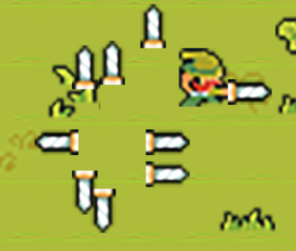

# Оружие героя

Карта немного поменялась, так как Линк врезался в мосты, которые соединяют нижние острова. Изменения делал непосредственно в Tiles и сохранял карту и csv-файлы. Чтобы всё было канонично, Линку выдадим меч. Спрайты на мечи я тоже отрисовал. Он лежит в папке weapons/sword. Там 5 картинок, где full обозначает сам меч, а остальные 4 — направления меча. Приступим к коду.

В файле setting.py, создаем словарь из оружий. У меня будет только один меч, но вы можете добавить больше оружия. Сам словарь:

```python
weapon_data = {'sword': {'cooldown': 300, 'damage': 15, 'graphic':'../graphic/weapons/sword/full.png'}}
```

Далее, создадим новый файл с настойкой оружия `weapon.py`:

```python
import pygame
​
class Weapon(pygame.sprite.Sprite):
    def __init__(self, player, groups):
        super().__init__(groups)
        self.image = pygame.Surface((40, 40)) #сама графика
        self.rect = self.image.get_rect(center = player.rect.center) #место отрисовки
```

Тут всё традиционно и без нового. Мы центруемся от самого игрока последней строкой в коде. Сейчас посередине будет рисоваться чёрный квадрат 40 на 40 пикселей. Импортируем новый файл в Level и создаём новый метод `create_attack`.

```python
def create_attack(self):
    Weapon(self.player, [self.visible_sprites]) 
```

Далее в самой отрисовке игрока, добавим наш метод как ссылку на него:

```python
self.player = Player((1000, 1000), [self.visible_sprites], self.obstacle_sprites, self.create_attack)
```

Далее перейдём в файл player.py и там передадим create\_attack и создадим демона. Также, при нажатии на пробел, добавим метод `self.create_attak()`. Теперь можем вернуться к отрисовке нашего оружия:

```python
import pygame
​
class Weapon(pygame.sprite.Sprite):
    def __init__(self, player, groups):
        super().__init__(groups)
        direction = player.status.split('_')[0] #обрезаем строку по "_" чтобы понимать куда он смотрит
        full_path = f'../graphic/weapons/{player.weapon}/{direction}.png' #адрес оружия
        self.image = pygame.image.load(full_path).convert_alpha() #сама графика
        if direction == 'right':
            self.rect = self.image.get_rect(midleft = player.rect.midright + pygame.math.Vector2(-10, 16))
        elif direction == 'left':
            self.rect = self.image.get_rect(midright = player.rect.midleft + pygame.math.Vector2(10, 16))
        elif direction == 'down':
            self.rect = self.image.get_rect(midtop = player.rect.midbottom + pygame.math.Vector2(-15, 0))
        else:
            self.rect = self.image.get_rect(midbottom = player.rect.midtop + pygame.math.Vector2(-15, 0))
```

Интересные моменты: во-первых, обрезаем строку по "\_" чтобы понять куда смотрит герой (неважно с "attack" или без). Затем отрисовка. Нам нужно чтобы меч рисовался в руке у Линка. Я выбрал следующий метод, если меч слева, то "приклеиться" он должен справа от Линка, то есть `midleft = player.rect.midright + pygame.math.Vector2(-10, 16)`. Далее, плюсуем вектор направления чтобы меч был ровно в руке. Далее всё повторяется в зависимости от направления.

Добавим в player.py новых демонов:

```python
self.create_attak = create_attak #создали атаку
self.weapon_index = 0 #номер оружия (если у вас будет несколько орудий пыток монстров)
self.weapon = list(weapon_data.keys())[self.weapon_index] #выбрали конкретное оружие и все его параметры
```

Теперь есть меч, но есть проблема. Мечи не исчезают:

<figure><figcaption></figcaption></figure>

Создадим новый метод в `level.py`: `destroy_weapon`. Помимо прочего, нужно немного переработать код в самом `level.py`. Создадим нового демона `self.current_attack = None`, а также переработаем метод `create_attack`.

```python
def create_attack(self):
    self.current_attack = Weapon(self.player, [self.visible_sprites])   
​
def destroy_weapon(self):
    if self.current_attack:
        self.current_attack.kill()
    self.current_attack = None
```

Таким образом, при наличии атаки, мы убиваем процесс и обнуляем указатель атаки (`current_attak`). Нужен ещё кулдаун. Также, не забудьте сослаться на `self.destroy_weapon` в player:

```python
self.player = Player((1000, 1000), [self.visible_sprites], self.obstacle_sprites, self.create_attack, self.destroy_weapon)
```

Далее пропишем метод в player.py и внесём в кулдаун новую функцию: `self.destroy_weapon()`. Результат:

<figure><figcaption></figcaption></figure>

[Файлы этапа можно скачать здесь](https://disk.yandex.ru/d/iNPvgc6Yu52cGg). Теперь настроим интерфейс.
