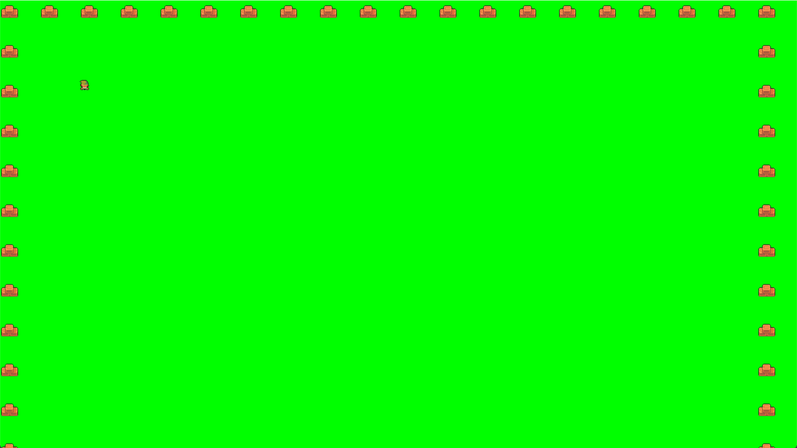

# Пишем уровень

Для начала нужно разобраться в понятии "класс" в концепции объектно-ориентированного программирования - ООП. Сейчас мы создадим класс `Level`. В этом классе есть всё необходимое для работы с объектами внутри. Класс `Level` и есть наша игра, так как именно этот класс собирает все **спрайты** (игрок, враги, карта мира и т.д.). Помимо самих спрайтов нас интересует набор элементов, связанных с подсчётом тех или иных пунктов. Как я говорил ранее, движок нужен для прописывания физики, а физика — это математический способ описать поведение объекта. Таким образом, мы взаимодействуем с **числами** и **параметрами**. Это тоже находится в классе `Level`. Например, если игрока ударит враг, то игрок потеряет 5% здоровья — это и есть наши параметры.

Но есть одна проблема – объектов очень много. Чтобы не искать в коде конкретный камень №67, будем разбивать код группами объектов. Для этого создадим две группы: `visible_sprites` и `obstacle_sprites`. Как вы уже поняли, группа `visible_sprites` отвечает за все объекты, которые пользователь видит (например, карту мира и персонажа), а `obstacle_sprites` — это объекты, которые нужны для технического использования. Все объекты можно сослать на конкретные группы или на набор групп. Так, объект "кот" может быть в группе объектов движущихся, но не взаимодействующих с игроком. Если же добавить кота в обе группы, он будет отображён и активен.

Приступим к коду. Создадим новый файл `level.py`. Пропишем в нём следующий код:

```python
import pygame
​
class Level: #Создали класс
    def __init__(self): #Базовые параметры
        self.visible_sprites = pygame.sprite.Group() #Создали группу видимых элементов
        self.obstacle_sprites = pygame.sprite.Group() #Создали группу технических элементов
​
    def run(self): #Создали метод в классе
        pass
```

Мы создали класс и в нём 2 группы, а затем в классе создали метод вызова данного класса. Далее нужно вернуться в main-файл и импортировать класс `Level` (`from level import Level`), объявить класс `Level` (`self.level = Level()`), а таже запустить его в самом run-методе в main (`self.level.run()`). Я решил пока убрать дебаг из проекта, так как сейчас дебажить нечего и финальный код в main-файле выглядит так:

```python
import pygame, sys #импортируем библиотеки PyGame и Sys
from settings import * #импорт из файла settings
from level import Level #+++ импорт из файла level класс Level +++
​
class Game: #основной класс игры
    def __init__(self): #создаём конструктор класса
        pygame.init() #конструктор использует конструкции из библиотеки PyGame
        self.screen = pygame.display.set_mode((WIDTH,HEIGTH)) #забирает из нашего проекта экран в виде размеров в ширину и высоту
        pygame.display.set_caption("PyZelda") #Устанавливаем название нашего окна
        self.clock = pygame.time.Clock() #а также, забирает из проекта время
        self.level = Level() #+++ объёвили Level +++
​
    def run(self): #функция запуска игры
        while True: #до выхода из игры она активна
            for event in pygame.event.get(): #просмотр событий в игре
                if event.type == pygame.QUIT: #сейчас мы можем только выйти и при выходе:
                    pygame.quit() #вызываем метод закрытия игры
                    sys.exit() #и закрываем окно системы
            self.screen.fill('green') #помимо событий, указываем цвет экрана
            self.level.run() #+++ запустили функцию run в файле level в классе Level +++
            pygame.display.update() #обновляем экран
            self.clock.tick(FPS) #запрашиваем FPS
​
if __name__ == '__main__': #запуск игры только из main-файла
    game = Game() #Если файл main, то сама игра вызывает класс...
    game.run() #...и запускает функцию run из класса
```

Давайте пропишем что-то в классе Level. Таким образом, мы создадим подложку из зелёного фона, а сверху наложим новые объекты. Для этого мы воспользуемся простым методом, как в и в дебаге: `display_surface = pygame.display.get_surface()`. В коде с Level оно выглядит так:

```python
import pygame
​
class Level: #создали класс
    def __init__(self): #базовые параметры
        self.display_surface = pygame.display.get_surface() #создали новый слой объектов
        self.visible_sprites = pygame.sprite.Group() #создали группу видимых элементов
        self.obstacle_sprites = pygame.sprite.Group() #создали группу технических элементов
​
    def run(self): #создали метод в классе
        pass
```

Сейчас ничего не поменяется, так как мы объявили что будем что-то рисовать, но ничего не нарисовали. Приступим к процессу отрисовки: для этого создадим новый файл `tile.py`.

```python
import pygame
from settings import *
​
class Tile(pygame.sprite.Sprite):
    def __init__(self, pos, groups):
        super().__init__(groups) #наследуем все группы
        self.image = pygame.image.load('../graphic/box.png').convert_alpha() #указываем адрес картинки
        self.rect = self.image.get_rect(topleft = pos) #указываем позицию отрисовки (левый верхний угол)
```

Интересного в этом коде мало. Мы импортируем pygame (снова и снова). Из файла `settings.py` мы берём всю информацию по разметке поля – поэтому мы его оставляем здесь. Далее, мы создаём новый класс `Tile`. В нём создаём параметры себя, позицию и группу наследования. Далее, командой `super()` мы включаем [наследование](https://docs-python.ru/tutorial/vstroennye-funktsii-interpretatora-python/funktsija-super/). Далее указываем картинки самих предметов и [`rect`](https://younglinux.info/pygame/rect) данных картинок. Из интересного, `convert_alpha()`. Эта функция пайгейма создает новую копию поверхности с желаемым форматом пикселей. Суровая необходимость, чтобы пайгейм понял что мы делаем.

Такой же код создадим в файле `player.py`:

```python
import pygame
from settings import *
​
class Player(pygame.sprite.Sprite):
    def __init__(self, pos, groups):
        super().__init__(groups)
        self.image = pygame.image.load('../graphic/link.png').convert_alpha()
        self.rect = self.image.get_rect(topleft = pos)
```

Отличие данного кода лишь в двух местах:

* Я создал класс `Player` вместо Tile
* Заменили картинку с коробок на героя Хайрула :)

Все пресеты картинок я взял из проекта [NinjaAdventure](https://pixel-boy.itch.io/ninja-adventure-asset-pack). Там есть способ скачать бесплатные сеты графики. Обрезал картики в фотошопе и получил мини-изображения.

Теперь отобразим нашу мировую карту. Делать мы это будем в файле `level.py`, так как именно в нём мы храним всю нужную информацию про конкретный уровень. Сразу импортируем `settings.py` и обратимся к карте. Финал работы будет выглядеть так:

```python
import pygame
from settings import *
​
class Level: #создали класс
    def __init__(self): #базовые параметры
        self.display_surface = pygame.display.get_surface() #создали новый слой объектов
        self.visible_sprites = pygame.sprite.Group() #создали группу видимых элементов
        self.obstacle_sprites = pygame.sprite.Group() #создали группу технических элементов
        self.create_map()
​
    def create_map(self):
        for row in WORLD_MAP:
            print(row)
​
    def run(self): #создали метод в классе
        pass
```

После запуска main-файла игра никак не поменялась, но мы в терминале отпечатали карту.

<figure><figcaption></figcaption></figure>

Про карту. Для упрощения работы я создал клетку (напомню, что она размером 64 на 64 пикселя), и указываю символами что куда ставить. Поставил карту я так: 'x' — это коробки, ',' — пустое место, а 'p' — это наш герой.

Это, конечно, круто, но вот я хотел бы нарисовать карту в игре, а не в терминале. Для этого, модернизируем код. Работаем только с файлом `level.py`:

```python
import pygame
from settings import *
from tile import Tile
from player import Player
​
class Level: #создали класс
    def __init__(self): #базовые параметры
        self.display_surface = pygame.display.get_surface() #создали новый слой объектов
        self.visible_sprites = pygame.sprite.Group() #создали группу видимых элементов
        self.obstacle_sprites = pygame.sprite.Group() #создали группу технических элементов
        self.create_map()
​
    def create_map(self):
        for row_index, row in enumerate(WORLD_MAP):
            for col_index, col in enumerate(row):
                x = col_index * TILESIZE
                y = row_index * TILESIZE
                if col == 'x':
                    Tile((x, y), [self.visible_sprites])
                if col == 'p':
                    Player((x, y), [self.visible_sprites])
​
    def run(self): #создали метод в классе
        self.visible_sprites.draw(self.display_surface)
```

Всё что я делаю — прохожу массив данных и умножаю элемент на 64, так как размер моего тайла равен 64 пикселям. Далее, если элемент равен `'x'` заменяю его на коробку, а если `'p'`, то на героя. Затем я прописал в методе запуска метод отрисовки поля. Также на карте я заменил одну `','` на `'p'`. И результат:

<figure><figcaption></figcaption></figure>

В main-файле, заменив цвет фона на чёрный, а размер тайла на 32 пикселя, я получил это:

<figure><figcaption></figcaption></figure>

[Файлы данного этапа для скачивания](https://disk.yandex.ru/d/ZYjndkgFeRALkA). Сразу оговорюсь, что отображение не совсем корректное из-за самих картинок. Я не подбивал их к размеру 64 на 64 пикселя. Далее я исправил это и вернул размер тайла в 64 на 64 пикселя.
