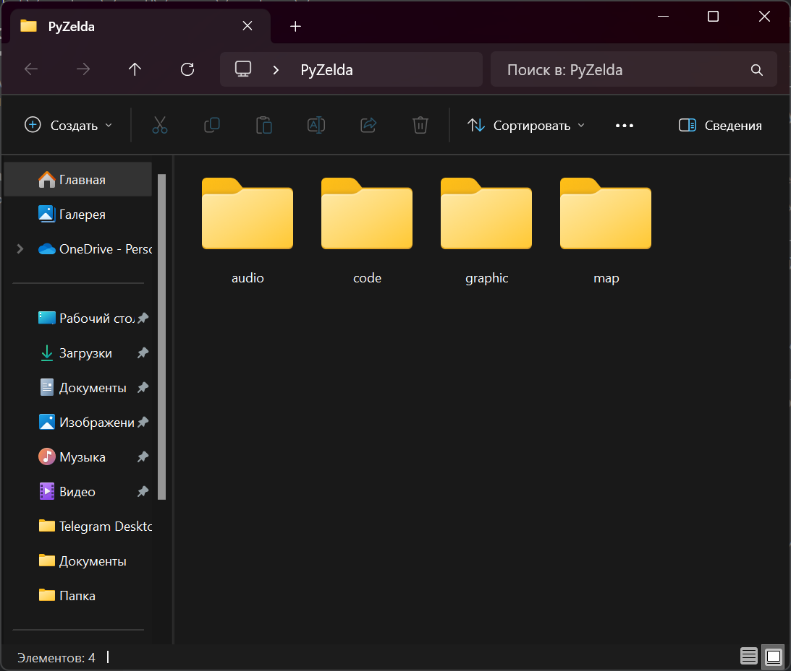
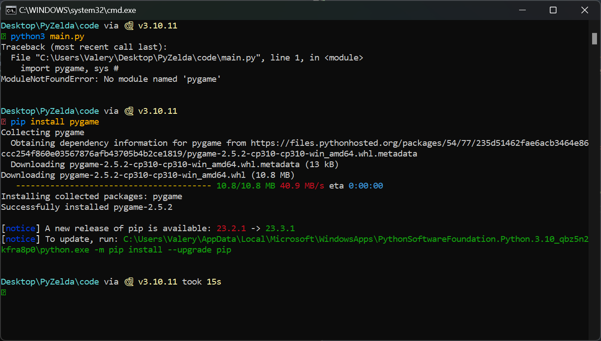
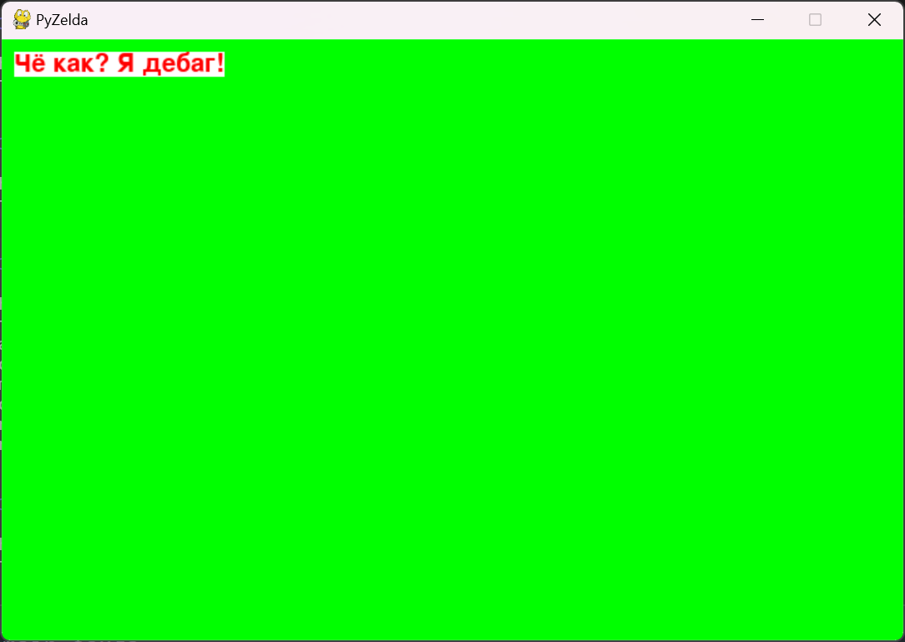

# Подготовка

Сначала создадим папку проекта. Я назвал проект PyZelda и в папке проекта есть ещё 4 директории: audio, code, graphic и map.

<figure><figcaption></figcaption></figure>

Далее в папке code создадим три файла:

* main.py — основной файл игры
* settings.py — настройки игры: тут мы укажем настройки полей и основных данных по окну и прорисовке.
* debug.py — файл дебагинга

Перед работой, не забудьте скачать библиотеку PyGame (`pip install pygame`)

<figure><figcaption></figcaption></figure>

Файл main:

```python
import pygame, sys #импортируем библиотеки PyGame и Sys
from settings import * #импорт из файла settings
​
class Game: #основной класс игры
    def __init__(self): #создаём конструктор класса
        pygame.init() #конструктор использует конструкции из библиотеки PyGame
        self.screen = pygame.display.set_mode((WIDTH,HEIGTH)) #забирает из нашего проекта экран в виде размеров в ширину и высоту
        pygame.display.set_caption("PyZelda") #Устанавливаем название нашего окна
        self.clock = pygame.time.Clock() #а также, забирает из проекта время
​
    def run(self): #функция запуска игры
        while True: #до выхода из игры она активна
            for event in pygame.event.get(): #просмотр событий в игре
                if event.type == pygame.QUIT: #сейчас мы можем только выйти и при выходе:
                    pygame.quit() #вызываем метод закрытия игры
                    sys.exit() #и закрываем окно системы
            self.screen.fill('green') #помимо событий, указываем цвет экрана
            pygame.display.update() #обновляем экран
            self.clock.tick(FPS) #запрашиваем FPS
​
if __name__ == '__main__': #запуск игры только из main-файла
    game = Game() #Если файл main, то сама игра вызывает класс...
    game.run() #...и запускает функцию run из класса
```

В файле main мы запускаем игру. Создаём конструктор на базе PyGame и работаем с входными файлами и данными.

Файл setting.py:

```python
WIDTH = 1280 #Ширина экрана
HEIGTH = 720 #Высота экрана
FPS = 60 #Число FPS
TILESIZE = 64 #Размер тайла (квадрата текстуры)
​
WORLD_MAP = [ #Карта мира игры. Она состоит из 20х20 квадратов
['x', 'x', 'x', 'x', 'x', 'x', 'x', 'x', 'x', 'x', 'x', 'x', 'x', 'x', 'x', 'x', 'x', 'x', 'x', 'x'],
['x', ',', ',', ',', ',', ',', ',', ',', ',', ',', ',', ',', ',', ',', ',', ',', ',', ',', ',', 'x'],
['x', ',', ',', ',', ',', ',', ',', ',', ',', ',', ',', ',', ',', ',', ',', ',', ',', ',', ',', 'x'],
['x', ',', ',', ',', ',', ',', ',', ',', ',', ',', ',', ',', ',', ',', ',', ',', ',', ',', ',', 'x'],
['x', ',', ',', ',', ',', ',', ',', ',', ',', ',', ',', ',', ',', ',', ',', ',', ',', ',', ',', 'x'],
['x', ',', ',', ',', ',', ',', ',', ',', ',', ',', ',', ',', ',', ',', ',', ',', ',', ',', ',', 'x'],
['x', ',', ',', ',', ',', ',', ',', ',', ',', ',', ',', ',', ',', ',', ',', ',', ',', ',', ',', 'x'],
['x', ',', ',', ',', ',', ',', ',', ',', ',', ',', ',', ',', ',', ',', ',', ',', ',', ',', ',', 'x'],
['x', ',', ',', ',', ',', ',', ',', ',', ',', ',', ',', ',', ',', ',', ',', ',', ',', ',', ',', 'x'],
['x', ',', ',', ',', ',', ',', ',', ',', ',', ',', ',', ',', ',', ',', ',', ',', ',', ',', ',', 'x'],
['x', ',', ',', ',', ',', ',', ',', ',', ',', ',', ',', ',', ',', ',', ',', ',', ',', ',', ',', 'x'],
['x', ',', ',', ',', ',', ',', ',', ',', ',', ',', ',', ',', ',', ',', ',', ',', ',', ',', ',', 'x'],
['x', ',', ',', ',', ',', ',', ',', ',', ',', ',', ',', ',', ',', ',', ',', ',', ',', ',', ',', 'x'],
['x', ',', ',', ',', ',', ',', ',', ',', ',', ',', ',', ',', ',', ',', ',', ',', ',', ',', ',', 'x'],
['x', ',', ',', ',', ',', ',', ',', ',', ',', ',', ',', ',', ',', ',', ',', ',', ',', ',', ',', 'x'],
['x', ',', ',', ',', ',', ',', ',', ',', ',', ',', ',', ',', ',', ',', ',', ',', ',', ',', ',', 'x'],
['x', ',', ',', ',', ',', ',', ',', ',', ',', ',', ',', ',', ',', ',', ',', ',', ',', ',', ',', 'x'],
['x', ',', ',', ',', ',', ',', ',', ',', ',', ',', ',', ',', ',', ',', ',', ',', ',', ',', ',', 'x'],
['x', ',', ',', ',', ',', ',', ',', ',', ',', ',', ',', ',', ',', ',', ',', ',', ',', ',', ',', 'x'],
['x', 'x', 'x', 'x', 'x', 'x', 'x', 'x', 'x', 'x', 'x', 'x', 'x', 'x', 'x', 'x', 'x', 'x', 'x', 'x'],
]
```

В settings.py будут все настройки игры. Стандартные ширина и высота окна, а также число FPS (частота обновления окна) и самая интересная часть — размер тайла. Как я говорил ранее, тайл — это квадрат текстуры и именно этот квадрат мы описываем размерами. Высота и ширина кадра измеряется в пикселях (я установил 1280 на 720), как и сам тайл, но есть важный момент — тайл всегда квадратный. Поэтому, мы прописываем размер квадрата тайла (он у нас 64 на 64 пикселя). Далее мы создаём карту мира. Сейчас она 20 на 20 тайлов (далее в проекте будем рисовать всё тайлами). Я обозначил, что `'x'` — это конец карты, а `','` — пустое место для игры.

Далее файл debug.py:

```python
import pygame #Снова обращаемся к PyGame
pygame.init() #Используем базовый конструктор
font = pygame.font.Font(None, 30) #Указываем шрифт
​
def debug(info, y = 10, x = 10):  #Сама функция дебага
    display_surface = pygame.display.get_surface() #Получаем ссылку на текущую установленную поверхность отображения в игре
    debug_surf = font.render(str(info), True, "Red") #Рендерим текст (я сделал его красным)
    debug_rect = debug_surf.get_rect(topleft = (x, y)) #Указывамем место отображения инфы на экране (левый верхний угол)
    pygame.draw.rect(display_surface, "White", debug_rect) #Делаем микро-консоль в виде прямоугольника (и да он белый, будет белая консоль с красным текстом)
    display_surface.blit(debug_surf, debug_rect) #Собираем нашу микро-консоль с параметрами текста
```

В этом файле мы создадим дебаг игры. Это поле, которое мы выводим вверху слева экрана, и в нём показываем нужный нам текст. Для запуска дебага нужно импортировать debug в main-файл и вывести что-то после отрисовки окна. Примерно так (файл main.py):

```python
import pygame, sys #импортируем библиотеки PyGame и Sys
from settings import * #импорт из файла settings
from debug import debug #импортируем дебаг <------------------
​
class Game: #основной класс игры
    def __init__(self): #создаём конструктор класса
        pygame.init() #конструктор использует конструкции из библиотеки PyGame
        self.screen = pygame.display.set_mode((WIDTH,HEIGTH)) #забирает из нашего проекта экран в виде размеров в ширину и высоту
        pygame.display.set_caption("PyZelda") #Устанавливаем название нашего окна
        self.clock = pygame.time.Clock() #а также, забирает из проекта время
​
    def run(self): #функция запуска игры
        while True: #до выхода из игры она активна
            for event in pygame.event.get(): #просмотр событий в игре
                if event.type == pygame.QUIT: #сейчас мы можем только выйти и при выходе:
                    pygame.quit() #вызываем метод закрытия игры
                    sys.exit() #и закрываем окно системы
            self.screen.fill('green') #помимо событий, указываем цвет экрана
            debug('Чё как? Я дебаг!') #Дебажим <------------------
            pygame.display.update() #обновляем экран
            self.clock.tick(FPS) #запрашиваем FPS
​
if __name__ == '__main__': #запуск игры только из main-файла
    game = Game() #Если файл main, то сама игра вызывает класс...
    game.run() #...и запускает функцию run из класса
```

Получим феерическую игру цветов:

<figure><figcaption></figcaption></figure>

[Стартовый набор файлов для скачивания](https://disk.yandex.ru/d/8jdGZBe3w3plAg).
