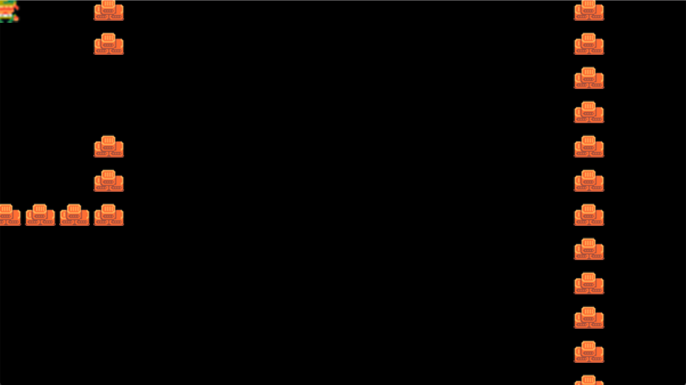
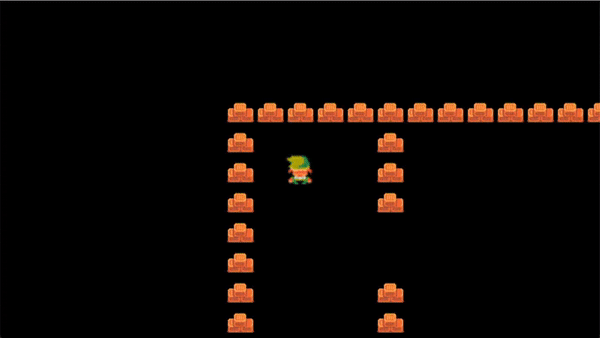
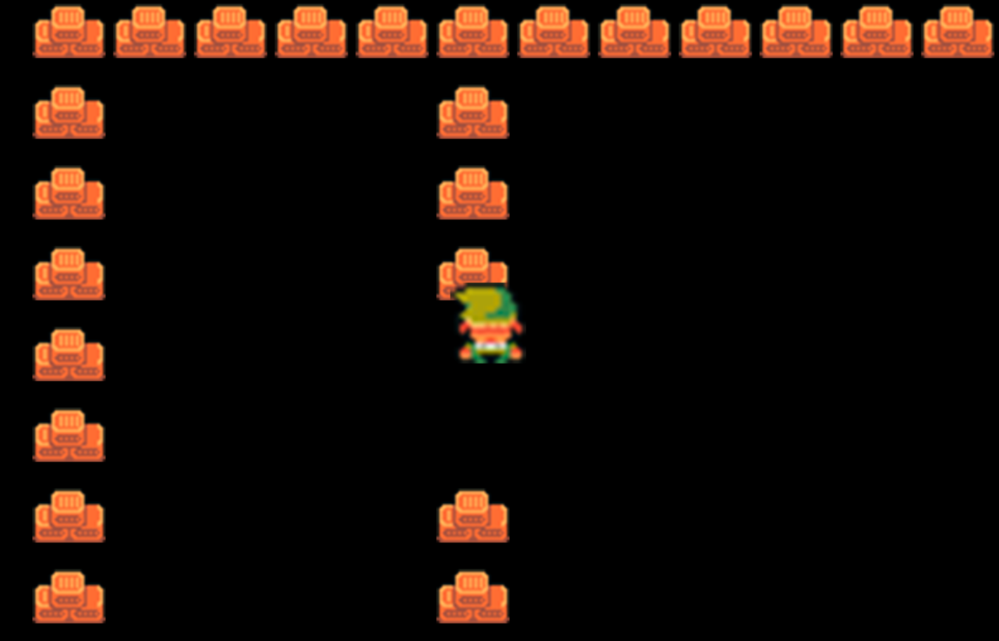

# Создание камеры

Предлагаю создать камеру с учётом вектора направления движения персонажа. Мы будем двигать камеру вместе с персонажем. Переходим к файлу уровня и создаём новый класс.

```python
class YSortCameraGroup(pygame.sprite.Group):
    def __init__(self):
        super().__init__()
```

Всё, что я сделал — создал новый пустой класс с наследованием всего и вся. Далее применяем его вместо `pygame.sprite.Group()` в `visible_sprites`, дабы не тавтологироваться, а ссылаться на класс с более тонкими настройками. Теперь к тонкостям:

```python
class YSortCameraGroup(pygame.sprite.Group):
    def __init__(self):
        super().__init__()
        self.display_surface = pygame.display.get_surface()
​
    def custom_draw(self):
        for sprite in self.sprites():
            self.display_surface.blit(sprite.image, sprite.rect) #прорисуем новую поверхность и отрисуем её
```

Здесь добавлены те же отображения новых поверхностей в главного демона с наследованием и создан метод ручной отрисовки (`custom_draw`).

Демон — это программа (или часть программы), которая запускается в фоновом режиме (без терминала или пользовательского интерфейса), ожидая событий и предлагая какие-то службы для их выполнения.

В коде самый интересный пункт в `display_surface.blit`. Surface создаёт новый слой объектов, а blit отрисовывает их. Далее мы передаём картинки и фигуры. Скоро и это перепишем, так как нам нужны векторы. Этим и займёмся. Вектор знаком вам по ходьбе Линка. Далее снова улучшим класс:

```python
class YSortCameraGroup(pygame.sprite.Group):
    def __init__(self):
        super().__init__()
        self.display_surface = pygame.display.get_surface()
        self.offset = pygame.math.Vector2()
​
    def custom_draw(self):
        for sprite in self.sprites():
            offset_pos = sprite.rect.topleft + self.offset #определяем позицию путём сравнения верхнего левого угла с вектором направления
            self.display_surface.blit(sprite.image, offset_pos) #прорисуем новую поверхность и отрисуем её
```

Из нового только одна конструкция в методе. Она направлена на определение верхнего левого угла, отрисовку и последующую сумму с вектором направления. Далее в run-методе, не забудьте поменять отрисовку с базовой на нашу кастомную. Примерно так:

```python
self.visible_sprites.custom_draw()
```

Если вы сделали всё верно, вставив в вектор 2 значения (x и y), вы увидите перемещение карты. Я поставил -150 и -150 и получил это:

<figure><figcaption></figcaption></figure>

Осталось перемещаться, зацепившись за героя. Его мы оставим по центру экрана (да здравствует эпохе Dendy). Наш код по доработке:

```python
class YSortCameraGroup(pygame.sprite.Group):
    def __init__(self):
        super().__init__()
        self.display_surface = pygame.display.get_surface()
        self.half_width = self.display_surface.get_size()[0] // 2 #середина отрисованного экрана по ширине
        self.half_heigth = self.display_surface.get_size()[1] // 2 #середина отрисованного экрана по высоте
        self.offset = pygame.math.Vector2()
​
    def custom_draw(self, player):
        self.offset.x = player.rect.centerx - self.half_width #координата x Линка
        self.offset.y = player.rect.centery - self.half_heigth #координата y Линка
        for sprite in self.sprites():
            offset_pos = sprite.rect.topleft - self.offset #определяем позицию путём сравнения верхнего левого угла с вектором направления
            self.display_surface.blit(sprite.image, offset_pos) #прорисуем новую поверхность и отрисуем её
```

В базовых демонов добавили размеры экрана и центр экрана (нацело делим пополам). В нашу кастомную рисовалку передадим координаты игрока и по x, y офсетам высчитаем их. Чтобы избавиться от "пьяной камеры", я вычитаю вектор направления, а не прибавляю его. Не забудьте run-методе передать `self.player`. Результат:

<figure><figcaption></figcaption></figure>

Теперь нужно разобраться с хитбоксами. Сейчас у нас графика из Денди, где каждый объект стоит по конкретным клеткам (тайлам). Нужно это исправить. Для начала перейдем к настройкам тайла и допишем один демон-элемент:

```python
self.hitbox = self.rect.inflate(0, -10)
```

Таким образом, мы уменьшили хитбокс на 10 пикселей. Так как отрисовка идёт из центра — мы уменьшаем хитбокс сверху и снизу на 5 пикселей. В демонах игрока пропишем тот же код, но уменьшим хитбокс на 26 пикселей. Далее, наша задача двигаться и проверять коллизии через хитбоксы. Для этого объекты с `rect.x` заменим на `hitbox.x`. Тогда move-функция выглядит так:

```python
def move(self, speed):
    if self.direction.magnitude() != 0:
        self.direction = self.direction.normalize()
    self.hitbox.x += self.direction.x * speed
    self.collision('horizontal')
    self.hitbox.y += self.direction.y * speed
    self.collision('vertical')
    self.rect.center = self.hitbox.center
```

Починим коллизии:

```python
def collision(self, direction):
    if direction == 'horizontal':
        for sprite in self.obstacle_sprites:
            if sprite.hitbox.colliderect(self.hitbox):
                if self.direction.x > 0: #двигаем вправо
                    self.hitbox.right = sprite.hitbox.left
                if self.direction.x < 0: #двигаем влево
                    self.hitbox.left = sprite.hitbox.right
​
    if direction == 'vertical':
        for sprite in self.obstacle_sprites:
            if sprite.hitbox.colliderect(self.hitbox):
                if self.direction.y > 0: #двигаем вниз
                    self.hitbox.bottom = sprite.hitbox.top
                if self.direction.y < 0: #двигаем вверх
                    self.hitbox.top = sprite.hitbox.bottom
```

Результат:

<figure><figcaption></figcaption></figure>

Линку отрывает шапку. Это происходит из-за того, что изображения хаотично находятся на поверхности. Какие-то выше, какие-то ниже. Исправим это через класс YSort (не просто же так мы мы назвали класс YSortCameraGroup). Поправим только одну строку:

```python
for sprite in self.sprites():
```

На строку:

```python
for sprite in sorted(self.sprites(), key = lambda sprite: sprite.rect.centery):
```

Мы сделали сортировку по y-координате. Про лямбду можно отдельно [почитать](https://habr.com/ru/companies/piter/articles/674234/), но если сказать грубо — лямбда-функция — функция, которая работает с анонимными функциями.

Итог:

<figure><figcaption></figcaption></figure>

[Ссылка на этап проекта](https://disk.yandex.ru/d/yQ82HKzPyOlTMw).
