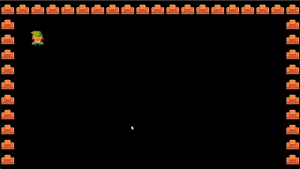
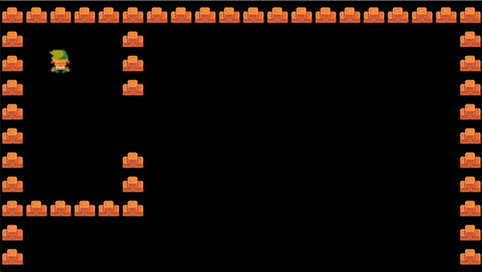

# Создаём игрока

Игрок должен уметь передвигаться и сталкиваться с существующими объектами. Сначала запишем его движения: переходим в `player.py` и прописываем функцию перемещения. Код в `player.py`:

```python
import pygame
from settings import *
​
class Player(pygame.sprite.Sprite):
    def __init__(self, pos, groups):
        super().__init__(groups)
        self.image = pygame.image.load('../graphic/link.png').convert_alpha()
        self.rect = self.image.get_rect(topleft = pos)
​
        self.direction = pygame.math.Vector2() #обращаемся к направлению через вектор
​
    def input(self): #варьируем кнопки
        keys = pygame.key.get_pressed()
​
        if keys[pygame.K_UP]:
            self.direction.y = -1
        elif keys[pygame.K_DOWN]:
            self.direction.y = 1
        else:
            self.direction.y = 0
​
        if keys[pygame.K_LEFT]:
            self.direction.x = -1
        elif keys[pygame.K_RIGHT]:
            self.direction.x = 1
        else:
            self.direction.x = 0
​
    def update(self):
        self.input()
```

Тут с кодом достаточно просто. В функции `self.direction = pygame.math.Vector2()` мы задаём вектор точке. Точка — это наш герой, а его вектор болтается в диапазоне от -1 до 1. Функция `keys = pygame.key.get_pressed()` позволяет продолжать нажатие и тогда, герой должен разгоняться. Если нажатия нет — вектор равен 0 и герой тормозит. Это очень условное, но приписывание инерции.

Ещё в файле `level.py` в функции `run` я записал обновление всех спрайтов. Это строчка кода вида:

```python
self.visible_sprites.update()
```

Ещё я переписал в том же файле вызов героя. Мне это нужно для глобализации позиции героя. Из строки

```python
Player((x, y), [self.visible_sprites])
```

Я сделал

```python
self.player = Player((x, y), [self.visible_sprites])
```

Продолжим прорисовку движений в файле `player.py`. Создадим ещё один параметр — скорость. Для этого в глобальные параметры (`__init__`) добавим строчку `self.speed = 5`

Также напишем функцию `move`:

```python
def move(self, speed):
        self.rect.center += self.direction * speed
```

И в update-функции пропишем движения персонажа: `self.move(self.speed)`.

Результат:

<figure><figcaption></figcaption></figure>

Если приглядеться, то по диагонали Линк бежит чуть быстрее. Дело в том, что он бежит по диагонали со скоростью корень из двух, что примерно равно 1.4. Мы прописали скорость вверх, вниз, влево и вправо равной 1, а вот по диагонали из правил математики, можно понять, что длина гипотенузы равна сумме квадратов длин оснований квадрата под корнем, то есть **корень из (1^2 + 1^2)**. Исправим данный баг нормализацией от PyGame (да-да, как в Unity). Исправленная функция движения:

```python
def move(self, speed):
    if self.direction.magnitude() != 0:
        self.direction = self.direction.normalize()
    self.rect.center += self.direction * speed
```

Теперь вторая проблема. Линк — танк. Он сбивает всё на своём пути. Нам нужны объекты, с которыми он будет сталкиваться Не забывайте, что все объекты у нас — квадраты тайлами.

Сейчас есть проблема — файл `player.py` не знает о наличии тайлов, которые отображаются через файл уровня. Поэтому дадим файлу новый аргумент. Добавим его в `init` и назовём `obstacle_sprites`. Также не забудьте в файле уровня сослаться на `obstacle_sprites` в отрисовке точки игрока. Для этого в файле `level.py` замените строку:

```python
self.player = Player((x, y), [self.visible_sprites])
```

На строку:

```python
self.player = Player((x, y), [self.visible_sprites], self.obstacle_sprites)
```

В файле игрока создадим метод столкновений под название `collision`. Функция:

```python
def collision(self, direction):
    if direction == 'horizontal':
        for sprite in self.obstacle_sprites:
            if sprite.rect.colliderect(self.rect):
                if self.direction.x > 0: #двигаем вправо
                    self.rect.right = sprite.rect.left
                if self.direction.x < 0: #двигаем влево
                    self.rect.left = sprite.rect.right
​
    if direction == 'vertical':
        for sprite in self.obstacle_sprites:
            if sprite.rect.colliderect(self.rect):
                if self.direction.y > 0: #двигаем вниз
                    self.rect.bottom = sprite.rect.top
                if self.direction.y < 0: #двигаем вверх
                    self.rect.top = sprite.rect.bottom
```

В ней всё разделено на две координаты. По горизонтальной оси — x, по вертикальной — y. Если столкновение произошло по горизонтали, то делаем смещения (вправо или влево). Тоже самое по вертикали, но там вниз и вверх. Последний шаг — разделить метод в движении на два варианта: вертикальный и горизонтальный. То есть из строки:

```python
self.rect.center += self.direction * speed
```

Делаем структуру:

```python
self.rect.x += self.direction.x * speed
self.collision('horizontal')
self.rect.y += self.direction.y * speed
self.collision('vertical')
```

Получаем героя Хайрула без наклонностей в приведение:

<figure><figcaption></figcaption></figure>

Из предыдущей гифки видна следующая задача — создание камеры. Этим и займёмся. [Ссылка на этот этап](https://disk.yandex.ru/d/mpG1VH3zri3ioA).
